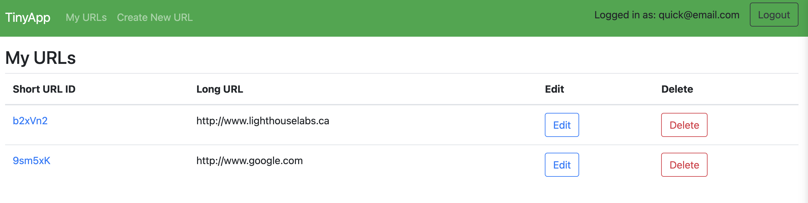
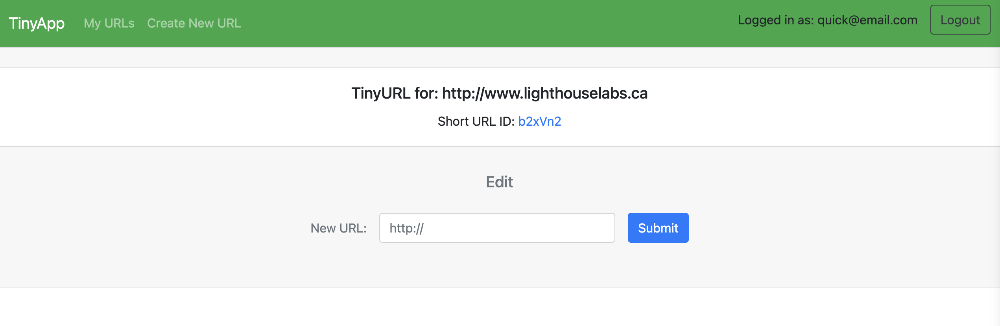
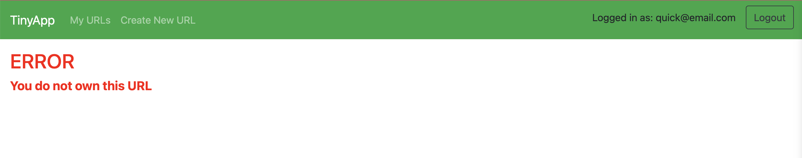

# TinyApp Project

TinyApp is a full stack web application built with Node and Express that allows users to shorten long URLs (à la bit.ly).

## Final Product

The first page the user sees after logging in

Editing a short URL

Error page showing relevant error messages

## Dependencies

* bcryptjs
* cookie-session
* ejs
* express
* method-override
* morgan
* chai
* mocha
* nodemon

## Getting Started

- Install all dependencies (using the `npm install` command).
- Run the development web server using the `npm start` command.
- Navigate to localhost:8080 in your browser